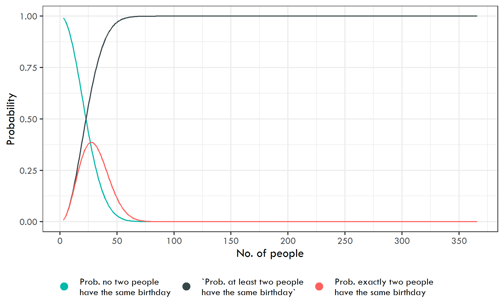

# Birthday Paradox

In this project, I calculate the probabilities that in a room of people with `n` people:
1. At least two people have the same birthday
2. No two people have the same birthday
3. Exactly two people have the same birthday

The math used to calculate these probabilities is explained in [this document](docs/Probability%20Calculation.pdf)

I calculated these probabilities with different values of `n` and visualized the probabilities as a function on `n`:

The probability that at least two people have the same birthday jumps to about 50% with only 23 people.